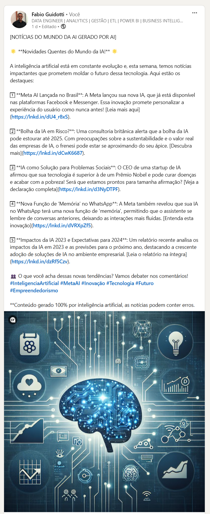

# LinkedIn AI Post

## 🌟 Objetivo

O **LinkedIn AI Post** é uma solução inovadora de automação projetada para revolucionar a forma como você compartilha novidades e notícias sobre inteligência artificial no LinkedIn. Com o poder da biblioteca Crewai, este projeto visa transformar o processo de criação de conteúdo em uma experiência fluida e eficiente, permitindo que profissionais e empresas mantenham uma presença ativa e informada na plataforma.

Para atingir esses objetivos ambiciosos, o projeto integra um conjunto de ferramentas de ponta: a Crewai para orquestração de tarefas, a OpenAI para geração de textos envolventes, a DALL-E 3 para criação de imagens impressionantes, a SERPER para busca e agregação de informações relevantes, e a API do LinkedIn para publicação direta. Essa sinergia tecnológica possibilita a criação de publicações que são não apenas úteis, mas também visualmente atraentes e impactantes.

## 🚀 Como Usar

Siga estas etapas simples para começar a usar o LinkedIn AI Post:

1. **Clone o repositório:**
   ```bash
   git clone https://github.com/FabioGuidotti/linkedin-ai-post.git
   cd linkedin-ai-post
   ```

2. **Instale as dependências:**
   ```bash
   pip install -r requirements.txt
   ```

3. **Configure suas credenciais:**
   - Crie um arquivo `.env` na raiz do projeto.
   - Adicione suas credenciais da API:
     ```plaintext
     LINKEDIN_CLIENT_ID=seu_client_id
     LINKEDIN_CLIENT_SECRET=seu_client_secret
     LINKEDIN_ACCESS_TOKEN=seu_access_token
     SERPER_API_KEY=sua_serper_api_key
     OPENAI_API_KEY=sua_openai_api_key
     ```

4. **Execute o script principal:**
   ```bash
   python main.py
   ```

## 📸 Exemplo de Resultado

Aqui está um exemplo de como o resultado final pode parecer no LinkedIn:



Com o LinkedIn AI Post, você está a um passo de transformar sua presença no LinkedIn com conteúdo automatizado e de alta qualidade. Explore, experimente e expanda seus horizontes digitais! 🌐
